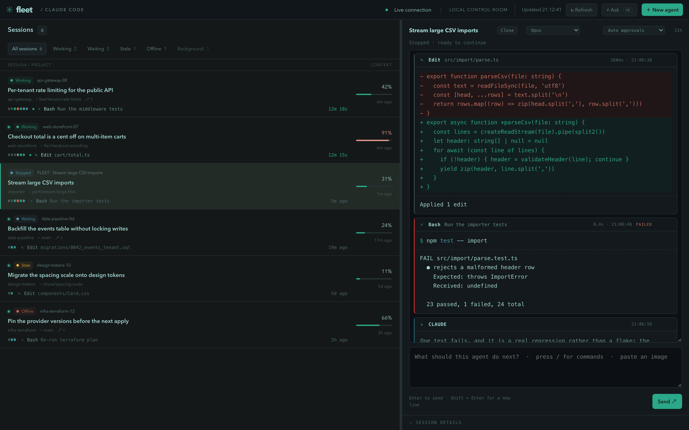
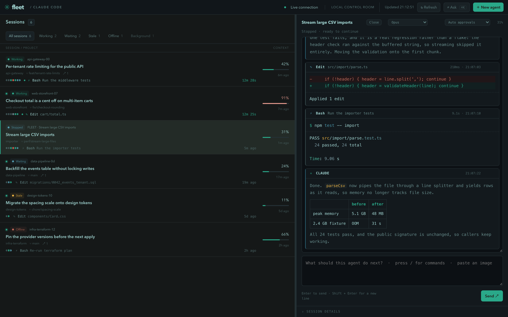

<div align="center">


# Claude Fleet

**A local control room for Claude Code.**

See every session running on your machine, launch agents you can talk to, hand a
bigger job to a manager-led team whose work an independent verifier checks before
it ships, and ask one question across everything you have ever worked on.


<br>
<br>



</div>

---

Claude Code is happiest in a terminal, which is fine until you have six of them.
Fleet gives that sprawl one window: what each session is doing, which one failed,
which one is about to run out of context, and which one has been waiting on you
for twenty minutes.

Terminal sessions are watched read-only. Fleet never injects keystrokes and never
kills a process it did not start. Agents you launch *from* Fleet are different:
those you can message, approve, interrupt and resume.

Everything runs on `127.0.0.1` against the Claude account already configured on
your machine. There is no service, no account, and no telemetry.

## Install

```bash
npm install -g @sergeychuvayev/claude-fleet
claude-fleet
```

That prints the URL it bound to and opens it. If port 7777 is taken, Fleet tries
the next ten. To try it without installing anything:

```bash
npx @sergeychuvayev/claude-fleet
```

```bash
claude-fleet start        # no browser window
PORT=8080 claude-fleet    # pick a port
claude-fleet install-app  # put "Claude Fleet" in ~/Applications (macOS)
claude-fleet update       # install the latest published version
claude-fleet --help       # every command and variable
```

Requires **Node 22+** and a working `claude` on your PATH.

Fleet checks npm for a newer version a few times a day and shows a pill in the
top bar when there is one. Clicking it installs the update and reloads; nothing
is installed without that click. From a git checkout the pill tells you to
`git pull` instead of offering to overwrite your working copy.

<details>
<summary><b>Running from a checkout</b></summary>

```bash
git clone https://github.com/sergey-chuvayev/claude-fleet && cd claude-fleet
npm install
./start.sh
```

`start.sh` is the same entry point as the installed `claude-fleet` command, so
both prefer the `claude` already on your PATH over the one bundled with the SDK.

</details>

## What it does

### The session list reads like a CI job

Each row is one session: its state, project, branch, context pressure, and the
story of its latest turn. The strip of segments is one segment per tool call
since your last message, coloured by the kind of work (grey for inspecting,
accent for changing files, cyan for commands, violet for sub-agents) and red
where a call failed, attributed by exact tool id rather than by name. Beside it,
in words, is the step running now or the last step taken. On the right, how long
the turn has been going.

Colour never carries meaning alone: every segment names its call on hover, and
the row has a spoken summary such as *"This turn: 4 inspecting, 2 changing files,
1 failed. Now: Bash Run the test suite."*

| State | Meaning |
|---|---|
| **Working** | Marked busy by Claude |
| **Waiting** | Alive, waiting for input |
| **Stale** | Alive but untouched for over three days |
| **Offline** | Registry entry whose process has exited |
| **In terminal** | A Fleet conversation currently held by a terminal |

Context turns amber at 75% and red at 90%. A `[1m]` marker or observed usage
above 200k identifies a 1M context window.

<details>
<summary><b>Background sessions and sub-agents</b></summary>

Sessions a program started rather than a person (an SDK run, a plugin's worker, a
background indexer) are kept out of the main list and counted under a
**Background** filter. They are identified by a registry `entrypoint` other than
`cli`. The registry records no parent, so Fleet walks the process tree: when an
ancestor is another session, that session's row shows a `⑂ n` badge and the
background row reads "via that session"; when the chain leads to a daemon
instead, the row names the program running it.

Tools invoked inside a turn, including sub-agents from the Task tool, run in the
session's own process and never appear as separate rows at all.

</details>

### The status bar watches the account, not the session

Context pressure is per conversation. The five-hour and weekly plan windows are not:
every Claude process on the machine draws on the same ones, including the terminal
sessions Fleet only watches. They get one line along the bottom of the window.

```
5h ▇▇▇▇▇▇░░░░ 62%  resets 13:28   ·   week 31%   ·   opus wk 48%
```

Only the window closest to stopping you gets a bar; the rest stay bare numbers. The
same 75% amber and 90% red as context, so "nearly full" reads the same way everywhere.
Past 90% the countdown replaces the bar, because by then the question is when it clears,
not how full it is.

When a request is actually refused, the bar turns into the refusal, and the new-agent
dialog says so before you write a prompt:

```
⊘ Rate limited · five-hour window · resets 11:42 (35m) · organisation spend cap reached
```

<details>
<summary><b>Where the numbers come from, and when they are missing</b></summary>

Three sources, none of them available all the time:

| Source | Gives | Available |
|---|---|---|
| `rate_limit_event` | utilisation, reset | only while a Fleet agent streams |
| The runtime's `/usage` data | every window, the plan | pulled once at the end of a turn |
| A refused request in any transcript | the wall and its reset | whenever it happened, to any session |

Nothing here ever spends a token to find out: a synthetic request would consume the
window it claims to measure. That has consequences the bar is explicit about.

Utilisation only refreshes while an agent is running, so after an idle stretch the
cluster dims and stamps itself `as of 09:38` rather than presenting an old reading as
current. Nothing measured yet shows nothing at all, never `0%`. On an API key, Bedrock
or Vertex, where plan limits do not apply, the cluster is absent entirely.

A refusal is the one signal that survives Fleet being idle, because it is written into
the transcript of whichever session hit it. It expires by itself at its reset time, and
a refusal with no reset time is discarded rather than shown: a warning that cannot
clear itself is worse than none. Being blocked never disables anything. Fleet says what
it knows and leaves the decision where it belongs.

</details>

### Old sessions can be put away

Every transcript Claude has ever written is a row, so a machine that has been
working for a month opens on ninety Offline sessions and three live ones. **Archive**
in the inspector takes one out of the list; under the **Offline** filter, a strip
offers to archive everything untouched past a threshold in one go, and to keep
doing it.

Archiving is a view, not an edit. Nothing moves and nothing is deleted:
`claude --resume <session id>` still reaches an archived session, Ask still finds
it, and **Restore** puts the row back. The set lives in `.fleet/archive.json`,
alongside Fleet's own conversations rather than inside `~/.claude`.

The standing rule only ever reaches sessions whose process has exited. A session
that is alive stays in the list however long it has been quiet, because a quiet
session you can still talk to is the one thing this dashboard exists to show you.
Restoring a session by hand also exempts it from the rule permanently, so the next
refresh cannot quietly undo the decision you just made.

### The conversation is a stack of blocks



Each message, tool call and tool result is its own block, the way a terminal
groups a command with its output. A block shows what ran, how long it took and
whether it failed, and can be collapsed or copied on its own. Long output starts
collapsed.

Tool blocks are rendered per tool: a shell command as a prompt line, an edit as a
diff, a to-do list as a checklist, everything else as its input. Assistant text is
Markdown with syntax-highlighted code. Markdown, sanitising and highlighting come
from `marked`, `DOMPurify` and `highlight.js`, bundled into `public/vendor/libs.js`
and served by Fleet itself. There is no CDN, and the page's content security policy
still allows scripts only from Fleet.

### Panels resize to fit the work

The session list and inspector share a horizontal split; drag it, or focus it and use the
arrow keys. Inside the inspector, the team overview and the composer are flat sections set
off by a rule rather than the rounded cards earlier versions used, and each carries its own
divider so the conversation between them can give up height to whichever one needs it.

Drag a divider, resize it from the keyboard with the arrow keys, jump to an extreme with
Home/End, or double-click to reset it. Sizes persist per browser and are clamped so neither
the conversation nor the panel being resized can be squeezed out of use. Under 720px width,
or while a panel is collapsed, its divider disappears and the layout falls back to normal
document flow.

### Reference another agent

In a Fleet-managed agent’s message composer, type **@** and search by session name,
project, or task. Use the arrow keys and Enter/Tab to attach a match, or drag a
session from the sidebar into the composer. `/` still opens commands and skills.

References appear as removable chips. Click a chip to open its source session;
your draft and its references stay with the receiving agent when you switch away.
Attach up to four sessions, then write an instruction such as “What is happening in
this session?” or “Use this agent’s findings to finish the fix.”

When you send, Fleet captures each source’s recent conversation, status and recent
activity. This works with Fleet agents, live terminal sessions and saved offline
sessions. The snapshot includes up to 12 recent user/assistant messages and is
limited to 8,000 characters per reference. Tool output and images are not copied.
The receiving agent gets this context alongside your message; the source agent is
not interrupted or sent a message. This is a snapshot, not a live agent-to-agent
reply. Expand the reference in your sent message to inspect what was shared.

References are resolved by the server at send time, and missing or self-references
are rejected without sending. Failed sends keep your draft and attachments.

### Ask your sessions

**Ask** in the top bar (`Cmd/Ctrl+K`) answers a question across every Claude Code
transcript on this machine: *"did we ever work out why recordings went missing on
answered calls?"* It replaces scrolling back through `claude --resume` hunting for
the session where something was decided.

It runs in two stages, and you see the first one immediately.

1. **Keyword pass, local.** Fleet indexes the visible conversation of every
   transcript modified in the last 60 days and ranks passages with BM25. Nothing
   leaves the machine, and it takes about 10 ms once the index is warm.
2. **Answer pass, one Claude call.** The best ten sessions and their excerpts go
   to a single short, tool-less turn that writes the answer and says which
   sessions are genuinely about the question. It cannot cite a session the
   keyword pass did not find. Haiku by default.

What gets indexed is what a person would recognise as the conversation: your
messages and Claude's replies. Tool calls and results are excluded, since they are
the bulk of a transcript and would match on file contents rather than discussion.

<details>
<summary><b>Why the answering turn is so bare</b></summary>

`tools: []`, no project settings, no CLAUDE.md, `persistSession: false` so a search
never becomes a transcript that the next search finds, and thinking disabled.
That last one is the whole latency budget: measured on a real corpus, adaptive
thinking cost 33 s and 2,800 output tokens for the same answer that takes 9 s and
578 tokens without it.

The `claude-mem` plugin's observer sessions are skipped entirely. They are
machine-written summaries of every other session, so they would out-match the real
conversation on every question.

</details>

### An initiative is a team behind one conversation

For a focused coding request, choose **New agent → Owner + review** to try the
opt-in execution mode. A Sonnet owner investigates, implements, tests, repairs and
finishes the PR in the same session. Only the independent Sonnet reviewer is
delegated. Existing presets and launch defaults remain unchanged. **Customize team…**
can save a copy with different models, tools, effort, turn limits and budget while
keeping its two-role workflow.

The owner registers one request task, commits a clean worktree, and submits test
evidence with the task tool's `ready` action. Fleet attaches the original request,
acceptance criteria, launch base commit, review commit/tree and prior findings to
the reviewer mandate. A blocking FAIL returns to the same owner for repair; optional
suggestions do not require another cycle. Defaults allow three submitted
implementations total (initial plus two repairs), one execution retry across the
request, and $10 of shared reported SDK usage. Creating follow-up tasks cannot reset
these limits. A crash or malformed report appears as **review error**, not a code
failure. The owner gets 100 turns per run and the reviewer 25, both at medium effort.

Verification belongs to the clean Git tree. Tracked or untracked changes make it
**stale**; ignored build files are not part of that snapshot. Empty commits and
administrative commands preserve a pass when the tree stays unchanged. Review is
checked at tool boundaries, on resume, at stop and when opening the session detail.
The owner handles PR creation and checks the actual URL, base and head with commands;
the verified badge records code review, not remote PR delivery. Reviewer shell access
uses the existing approval mode and is not a read-only security sandbox. Usage is
reported by the SDK, so the cap remains an execution cutoff with possible overshoot.

The manager-led presets below remain available for work that benefits from several roles.

Some work is too big for one agent and too small to project-manage by hand. Launch it with a
**team** instead of alone and you get an *initiative*: a manager that plans and delegates,
one or more roles that implement, and a required verifier that checks the work
independently, all behind a single conversation.

You talk to the manager and only to the manager. That is not a rule in a prompt: the manager
holds the main thread, and the rest of the team is reachable only through the Agent tool, so
they have no channel to you at all. Their work arrives as delegation blocks in the
conversation, each showing the role, the mandate it was given, and the report it sent back.

The manager has no shell or edit tools. Its only way to ship is to delegate and to track the
work through Fleet's task tool, which is the entire point of having a team rather than an
agent with a long prompt. A verifier has no direct edit tools either: it reproduces the
problem, runs the project's own gates, and returns PASS or FAIL with evidence, so a
developer's account of its own work is never the last word, and the manager cannot mark a
task verified itself. Bash, where a verifier's role enables it for running tests, stays a
general-purpose shell governed by the initiative's approval mode, not a read-only sandbox. A
failed review sends work back for repair and invalidates the previous attempt's reviews.

In **New agent**, **Software delivery** gives a brief to a Manager backed by Product,
Developer, Reviewer and QA roles: three implementation attempts per task and $10 in reported
SDK usage before it stops for you, adjustable while the initiative is idle. **Quick task**
trims that to a Sonnet manager, one developer and one independent verifier, for small, clearly
scoped changes, with two attempts and a $3 cap. **No team · single agent** skips orchestration
for a one-line fix. **Customize team…** saves your own roster: rename, add or remove roles,
write their instructions, pick a model, turn limit, reasoning effort and allowed tools per role, up to eight roles with at
least one manager and one verifier. Each initiative snapshots its team at launch, so editing a
template only affects the initiatives you start after that.

An initiative works in a git worktree of its own, branched from wherever the project is
checked out, so a team editing files cannot collide with your own editing or with another
initiative. It finishes at a local branch, with the manager expected to open a pull request
as its last delegated action. Doing that requires a push, and a push stops for your approval
like any other publishing command, so nothing leaves the machine without that click.

Closing an initiative forgets Fleet's record of the conversation and leaves the worktree and
its branch alone. Deleting code is never the same click as tidying a list.

Each delegation adds context and reporting overhead. Use a team when independent work or
verification warrants it. For a one-line fix, launch an agent.

Fleet explicitly selects the manager's model (Sonnet for a single agent) and removes a
trailing `[1m]` suffix instead of inheriting the global extended-context choice. This avoids
opting into the extended window; it is not a hard token ceiling on an existing conversation.
Built-in roles use these limits, configurable in copied teams:

| Role | Maximum turns | Effort | Model |
| --- | --- | --- | --- |
| Manager | 100 | high | Opus; Sonnet in Quick task |
| Developer | 40 | medium | Sonnet |
| Reviewer | 20 | medium | Sonnet |
| QA | 20 | low | Haiku |
| Product | 15 | medium | Opus |

Other custom roles default to 30 turns and medium effort. Delegates are instructed to
report within 30 lines and return `SPLIT_REQUIRED` before exhausting their turn allowance;
managers should split remaining work instead of raising the cap. Report length is a prompt
instruction, not output truncation. Bug fix uses independent QA, three attempts and a $10
API-equivalent budget; Quick task retains two attempts and $3. Delivery retains three and $10.
Legacy snapshots get missing role limits when compiled; explicit saved settings remain in
effect, except extended-context model suffixes are removed.

<details>
<summary><b>The task board, and what "verified" actually means</b></summary>

The manager creates tasks with owners, acceptance criteria and dependencies through Fleet's
task tool, up to 100 per initiative. The initiative inspector shows the roster, task states,
assignments and returned reports. Reads from the board return compact metadata, so checking
task state repeatedly does not re-inject every assignment, tool output and report into the
manager's context; the manager can pull one delegation's full record with the task tool's
`inspect` action.

Delegations run sequentially in the shared worktree. After an interruption, the saved board
survives and unfinished delegations are marked interrupted, so messaging the manager resumes
where it left off. "Verified" records the configured verifier's PASS/FAIL for that attempt,
not a guarantee that the evaluation was correct or that later work cannot regress it. The SDK
budget is an execution cutoff, not a billing guarantee: usage is reported at turn end, and a
killed runtime may not report its final spend, and each manager run also has its configured SDK turn limit
with bounded continuation reminders. Custom teams live in `teams.json` under Fleet's state
directory; task history and team snapshots live with the initiative in `sessions.json`.

</details>

### Inspect individual agents

Select a subagent row beneath a managed initiative to see its assignment, actual model,
status, elapsed time, attempt, tool steps, and report. Expand **Input and output** for a
tool's recorded payload. The inspector is read-only; direction and approvals still go through
the manager. Tool history keeps the most recent 200 steps with bounded inputs and outputs, and
older runs may have no recorded steps or usage.

Reported input/output and cache tokens are shown when available, falling back to SDK progress
totals otherwise; repeated assistant events do not count usage twice, and per-agent cost
appears only when the SDK explicitly reports it rather than being shown as zero. Token totals
describe recorded usage across messages, not current context size.

### Approvals that stay out of the way

Every agent runs in one of three modes, chosen at launch and changeable from the
conversation header.

- **Auto** (the default) answers ordinary requests for you and still stops for
  anything that destroys data (`rm`, `shred`, `dd`), reaches another host
  (`curl`, `wget`, `ssh`, `rsync`), runs an unreviewable script (`sh -c`, `eval`),
  escalates (`sudo`, `doas`), or publishes (`git push`, `npm publish`).
- **Ask every time** runs nothing unreviewed.
- **Approve everything** never stops.

A command is judged per shell segment, so `cd build && rm -rf .` is read as `rm`,
and wrappers like `env FOO=1`, `xargs` and `find -exec` do not hide it. A question
from Claude and a plan for review always reach you, in every mode. Blocks Fleet
approved on your behalf are marked **auto**, so a quiet run is never a silent one.
Your existing Claude permission rules and hooks still apply first.

That list is one array in [`permissions.js`](permissions.js). Edit it to taste.

<details>
<summary><b>Models, images, slash commands, and sessions held elsewhere</b></summary>

**Models.** Picked at launch and switchable from the conversation header. A change
applies from your next message, because each message starts a fresh query against
the same resumed session. The list is the runtime's own once a run has reported
it, and falls back to Opus/Sonnet/Haiku before then.

**Images.** Paste a screenshot into the composer or drop a file on it. Up to six
per message, PNG/JPEG/GIF/WebP, 8 MB each. Bytes are sniffed rather than trusted by
declared type, and stored owner-only under `.fleet/attachments/` with a fresh id,
which is the only thing the `/api/attachments/<id>` route accepts.

**Slash commands.** Type `/` at the start of a line to search this project's
commands and skills: yours, the project's, and each plugin's. The picker only
writes text into the composer, and nothing runs until you send. Claude Code's
built-ins (`/model`, `/clear`, `/compact`) are interpreted by the interactive CLI
rather than the SDK, so they are deliberately absent; where Fleet can offer the
same thing it does so as a real control instead.

**Held elsewhere.** If you resume a Fleet conversation in a terminal, its row
switches to **In terminal**, mirrors what that terminal is doing, and the composer
says which window has it and since when. Fleet refuses to send until that process
exits, because two writers on one transcript would corrupt it.

**Limits.** Four simultaneous runs, one turn per agent, up to 100 managed
conversations, messages up to 16,000 characters. The latest 200 conversation
entries persist in `.fleet/sessions.json`. Claude keeps its own full transcript, so
`claude --resume <session id>` still reaches a conversation Fleet has forgotten.

</details>

### It borrows your terminal's colours

Fleet reads the active theme named in `~/.warp/settings.toml`, loads it from
`~/.warp/themes/`, and serves it as CSS variables at `/theme.css`. Surfaces and
muted text are mixed from the terminal's own background and foreground with
`color-mix()`, so any Warp theme produces a coherent dashboard rather than a
clashing one.

Only colour values and the terminal font size are read, a theme file outside the
themes directory is ignored, and anything that is not a hex colour is discarded.
Without Warp installed, Fleet uses its own palette. Set `CLAUDE_FLEET_WARP_DIR` to
read a different directory.

The app icons are drawn geometrically from that same palette by `npm run icons`,
with no image library, so rerun it if you switch themes.

### It can live in the Dock

`claude-fleet install-app` puts **Claude Fleet.app** in `~/Applications`. Opening
it starts the server if it is not already listening, then opens Fleet in a Chrome
app window with no tab strip or address bar. It falls back to Edge, then Brave,
then your default browser, and logs to `~/Library/Logs/claude-fleet.log`. The
bundle holds no credentials and no copy of the project, only the paths to node and
to Fleet's entry point — which npm keeps stable, so updates do not break it. If you
later switch Node versions with a version manager, rerun `claude-fleet install-app`;
until you do, the app says so in a notification rather than failing silently.

Fleet also serves a web app manifest, so you can install it from the browser
instead: in Chrome, **⋮ → Cast, Save and Share → Install page as app**; in Safari,
**File → Add to Dock**.

## Local boundary

Fleet binds to `127.0.0.1`. It rejects unrecognised Host headers and cross-origin
requests, requires a per-server token for actions, serves only explicit UI assets,
and does not enable CORS. **Do not expose this server through a public proxy.**

Managed agents can modify files and run tools as permitted by your Claude settings
and approvals. Monitoring external sessions only ever reads their state, and
archiving one changes only Fleet's own record of what to show.

Asking a question reads every transcript in the window, including sessions from
other projects, and sends the matched excerpts (not whole transcripts) to Claude as
one prompt. That is the only part of Fleet that leaves the machine.

Local state files use owner-only permissions. A process lock prevents two Fleet
servers from controlling the same stored conversations. Graceful shutdown cancels
managed runs and pending approvals; stopping Fleet does not stop external agents.

GitHub PR and Linear issue links shown on a row are extracted from visible
conversation text. They are recorded references, not live PR or ticket status, and
no API credentials are involved.

## How it is built

Vanilla HTML, CSS and JavaScript over a Node HTTP server, with the official Claude
Agent SDK for managed runs. Five runtime dependencies, no framework, no build step
for the app itself.

| File | Responsibility |
|---|---|
| [`server.js`](server.js) | Local HTTP API, event stream, origin and token checks, static assets |
| [`fleet.js`](fleet.js) | Cached, read-only collection of external Claude sessions |
| [`archive.js`](archive.js) | Which sessions are put away, the age rule, and its store |
| [`managed.js`](managed.js) | SDK runs, approvals, tool blocks, persistence, cancellation |
| [`references.js`](references.js) | Resolves `@`-mentioned sessions and snapshots what a reference shares |
| [`teams.js`](teams.js) | The roles an initiative runs, and how they compile into SDK options |
| [`team-store.js`](team-store.js) | Custom team definitions, saved and edited outside the built-in presets |
| [`tasks.js`](tasks.js) | The task board: tasks, delegations, and the initiative's verification ledger |
| [`worktree.js`](worktree.js) | The git worktree an initiative works in, and its branch |
| [`usage.js`](usage.js) | The account's plan-usage windows behind the status bar |
| [`search.js`](search.js) | Transcript index, BM25 ranking, and the answering turn |
| [`permissions.js`](permissions.js) | The three approval modes and the command list that still stops |
| [`theme.js`](theme.js) | Reads the local Warp palette and renders it as CSS variables |
| [`catalog.js`](catalog.js) | Read-only listing of a project's slash commands and skills |
| `public/app.js` | Dashboard layout, session list, filters, monitoring, resizable panels |
| `public/blocks.js` | Incremental block rendering, Markdown, highlighting |
| `public/control.js` | Launch form, composer, approvals, streamed updates |
| `public/ask.js` | The Ask panel, its polling, and the result cards |
| [`paths.js`](paths.js) | Where Fleet's own state lives, and carrying over an old checkout's |
| [`update.js`](update.js) | The npm version check, its cache, and the self-install |
| [`open.js`](open.js) | Opens the dashboard as a Chromium app window, falling back across browsers |
| [`bin/claude-fleet.js`](bin/claude-fleet.js) | The installed command: start, install-app, update |
| `build/` | Vendored browser bundle, icon drawing, macOS launcher |

Fleet keeps its own state — conversations, attachments, the archive, the process
lock — in `~/.claude-fleet`, never in the install directory, which npm replaces on
every update. A pre-install `.fleet/` next to a checkout is copied over on first
run and left in place.

### Environment

| Variable | Effect |
|---|---|
| `PORT` | Preferred port, default 7777 |
| `CLAUDE_FLEET_HOME` | Where Fleet keeps its own state, default `~/.claude-fleet` |
| `CLAUDE_FLEET_DEFAULT_CWD` | Directory a new agent starts in when none is picked |
| `CLAUDE_FLEET_DIR` | Claude home to read sessions from, default `~/.claude` |
| `CLAUDE_FLEET_EXECUTABLE` | Absolute path to the `claude` binary, or `bundled` for the SDK's own |
| `CLAUDE_FLEET_WARP_DIR` | Warp configuration directory to theme from |
| `CLAUDE_FLEET_QUEUE` | `1` makes a turn over the concurrency limit wait for a free agent instead of being refused |
| `CLAUDE_FLEET_CONCURRENCY` | How many agents may run at once, 1 to 8, default 4 |
| `CLAUDE_FLEET_SEARCH_DAYS` | How far back Ask indexes transcripts, default 60 |
| `CLAUDE_FLEET_SEARCH_MODEL` | Model for the Ask answering turn |

The SDK ships its own Claude runtime, which can lag the CLI you actually use and
so offer an older set of models. The `claude-fleet` command therefore prefers the
`claude` on your PATH. Running `node server.js` directly does not apply this
preference.

### Development

```bash
npm test          # node --test across *.test.js
npm run vendor    # rebuild public/vendor/libs.js after changing its inputs
```

Tests run against a throwaway `CLAUDE_FLEET_HOME` (see `test-setup.js`), so a test
run never touches your real state.

Releasing is a tag push. `npm version patch && git push --follow-tags` runs the
suite, checks the tag against `package.json`, and publishes to npm with provenance.

`app.js`, `blocks.js` and `control.js` are classic scripts sharing one global
scope, so a duplicate top-level `const` across files is a `SyntaxError` that kills
the page and `node --check` cannot see it. The test suite loads all three in one VM
context and fails on any such collision. **Run `npm test` after touching a browser
script.**

Fleet reads `index.html` from disk per request, but its static allowlist is held in
memory, so an old process will serve a new page whose new assets 404. Restart after
adding a route.

## License

MIT. See [LICENSE](LICENSE).

<div align="center">
<sub>Screenshots use synthetic sessions generated for the purpose. Fleet is not affiliated with Anthropic.</sub>
</div>
