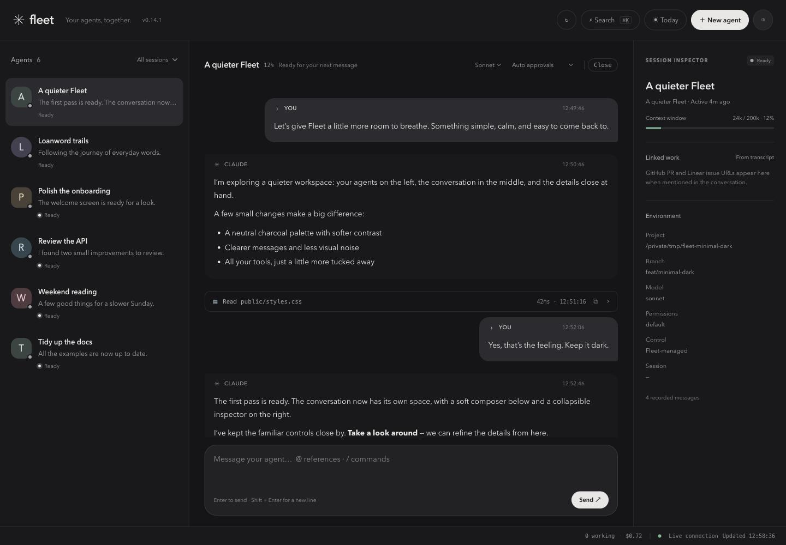

<div align="center">


# Claude Fleet

**A local control room for Claude Code.**

See every Claude Code session on your machine, run agents and teams from one window,
and plan your day around what needs you.


<br>
<br>


</div>

---

## What it does

Claude Code is happiest in a terminal, which is fine until you have six of them.
Fleet gives that sprawl one window.

- **Watch every session.** Each row shows what a session is doing, which one failed,
  which one is close to running out of context, and which one has been waiting on you.
  Sessions you started in a terminal are watched read-only.
- **Launch agents and talk to them.** Start an agent from Fleet, then message it,
  approve its commands, interrupt it or resume it later.
- **Hand bigger jobs to a team.** A manager plans and delegates, roles implement, and
  an independent verifier checks the work before it counts as done.
- **Plan your day.** The Today tab keeps a board of what needs your attention from
  Slack, Linear, GitHub, meetings and your calendar, and works through it with you.
- **Ask across everything.** One search box answers questions over every transcript
  on your machine.

Everything runs on `127.0.0.1` against the Claude account already configured on your
machine. There is no service, no account, and no telemetry. Fleet never injects
keystrokes into a terminal and never kills a process it did not start.

## Install and quick start

You need **Node 22+** and a working `claude` on your PATH.

```bash
npm install -g @sergeychuvayev/claude-fleet
claude-fleet
```

That prints the URL it bound to and opens it. To try it without installing anything,
run `npx @sergeychuvayev/claude-fleet`.

Then:

1. Open **Sessions**. Your running and recent Claude Code sessions are already there.
2. Press **New agent**, pick a folder, write a task and send it. Pick a team instead of
   a single agent for bigger work.
3. Open **Today** and press **Start my day** to build your board.

The [user guide](docs/user-guide.md) walks through each of these.

```bash
claude-fleet start        # no browser window
PORT=8080 claude-fleet    # pick a port
claude-fleet install-app  # put "Claude Fleet" in ~/Applications (macOS)
claude-fleet update       # install the latest published version
claude-fleet service on   # start Fleet at login and keep it running (macOS)
claude-fleet --help       # every command and variable
```

If port 7777 is taken, Fleet tries the next ten.

Fleet checks npm for a newer version a few times a day and shows a pill in the
top bar when there is one. Clicking it installs the update and reloads; nothing
is installed without that click. From a git checkout the pill tells you to
`git pull` instead of offering to overwrite your working copy.

<details>
<summary><b>Running from a checkout</b></summary>

```bash
git clone https://github.com/sergey-chuvayev/claude-fleet && cd claude-fleet
npm install
./start.sh
```

`start.sh` builds the web app into `dist/` (`npm run build:frontend`, about a second)
and then runs the same entry point as the installed `claude-fleet` command, so both
prefer the `claude` already on your PATH over the one bundled with the SDK. Running
`node bin/claude-fleet.js` directly needs that build first; without it Fleet stops at
startup and says so.

</details>

## Features in depth

### The session list reads like a CI job

Each row is one session: its state, project, branch, context pressure, and the
story of its latest turn. The strip of segments is one segment per tool call
since your last message, coloured by the kind of work (grey for inspecting,
accent for changing files, cyan for commands, violet for sub-agents) and red
where a call failed, attributed by exact tool id rather than by name. Beside it,
in words, is the step running now or the last step taken. On the right, how long
the turn has been going.

Colour never carries meaning alone: every segment names its call on hover, and
the row has a spoken summary such as *"This turn: 4 inspecting, 2 changing files,
1 failed. Now: Bash Run the test suite."*

| State | Meaning |
|---|---|
| **Working** | Marked busy by Claude |
| **Waiting** | Alive, waiting for input |
| **Stale** | Alive but untouched for over three days |
| **Offline** | Registry entry whose process has exited |
| **In terminal** | A Fleet conversation currently held by a terminal |

Context turns amber at 75% and red at 90%. A `[1m]` marker or observed usage
above 200k identifies a 1M context window.

<details>
<summary><b>Background sessions and sub-agents</b></summary>

Sessions a program started rather than a person (an SDK run, a plugin's worker, a
background indexer) are kept out of the main list and counted under a
**Background** filter. They are identified by a registry `entrypoint` other than
`cli`. The registry records no parent, so Fleet walks the process tree: when an
ancestor is another session, that session's row shows a `⑂ n` badge and the
background row reads "via that session"; when the chain leads to a daemon
instead, the row names the program running it.

Tools invoked inside a turn, including sub-agents from the Task tool, run in the
session's own process and never appear as separate rows at all.

</details>

### The status bar watches the account, not the session

Context pressure is per conversation. The five-hour and weekly plan windows are not:
every Claude process on the machine draws on the same ones, including the terminal
sessions Fleet only watches. They get one line along the bottom of the window.

```
5h ▇▇▇▇▇▇░░░░ 62%  resets 13:28   ·   week 31%   ·   opus wk 48%
```

Only the window closest to stopping you gets a bar; the rest stay bare numbers. The
same 75% amber and 90% red as context, so "nearly full" reads the same way everywhere.
Past 90% the countdown replaces the bar, because by then the question is when it clears,
not how full it is.

When a request is actually refused, the bar turns into the refusal, and the new-agent
New agent dialog says so before you write a prompt:

```
⊘ Rate limited · five-hour window · resets 11:42 (35m) · organisation spend cap reached
```

<details>
<summary><b>Where the numbers come from, and when they are missing</b></summary>

Three sources, none of them available all the time:

| Source | Gives | Available |
|---|---|---|
| `rate_limit_event` | utilisation, reset | only while a Fleet agent streams |
| The runtime's `/usage` data | every window, the plan | pulled once at the end of a turn |
| A refused request in any transcript | the wall and its reset | whenever it happened, to any session |

Nothing here ever spends a token to find out: a synthetic request would consume the
window it claims to measure. That has consequences the bar is explicit about.

Utilisation only refreshes while an agent is running, so after an idle stretch the
cluster dims and stamps itself `as of 09:38` rather than presenting an old reading as
current. Nothing measured yet shows nothing at all, never `0%`. On an API key, Bedrock
or Vertex, where plan limits do not apply, the cluster is absent entirely.

A refusal is the one signal that survives Fleet being idle, because it is written into
the transcript of whichever session hit it. It expires by itself at its reset time, and
a refusal with no reset time is discarded rather than shown: a warning that cannot
clear itself is worse than none. Being blocked never disables anything. Fleet says what
it knows and leaves the decision where it belongs.

</details>

### Old sessions can be put away

Every transcript Claude has ever written is a row, so a machine that has been
working for a month opens on ninety Offline sessions and three live ones. **Archive**
in the inspector takes one out of the list; under the **Offline** filter, a strip
offers to archive everything untouched past a threshold in one go, and to keep
doing it.

Archiving is a view, not an edit. Nothing moves and nothing is deleted:
`claude --resume <session id>` still reaches an archived session, Ask still finds
it, and **Restore** puts the row back. The set lives in `.fleet/archive.json`,
alongside Fleet's own conversations rather than inside `~/.claude`.

The standing rule only ever reaches sessions whose process has exited. A session
that is alive stays in the list however long it has been quiet, because a quiet
session you can still talk to is the one thing this dashboard exists to show you.
Restoring a session by hand also exempts it from the rule permanently, so the next
refresh cannot quietly undo the decision you just made.

### Worktrees shows what agents left behind

Agents leave a git worktree per task, and they pile up after the pull requests merge.
The **Worktrees** tab lists the checkout every session worked in: its branch, whether
that branch is merged into `main`, whether a pull request is open, and whether it holds
uncommitted or unpushed work. Merged is measured against the trunk as last fetched, and
pull requests come from your own `gh` when it is signed in. Without `gh`, a
squash-merged branch reads as unmerged, which only ever keeps it.

**Clear…** appears only on a worktree that is merged, clean and unpushed-free, and has
no session running in it. It opens a confirmation that names the folder and the local
branch that will be removed, and what is left alone. Fleet checks again when you
confirm, runs `git worktree remove` without `--force` from the main checkout, and
deletes the branch only if it still points at the commit it checked. Dirty, unpushed,
unmerged, locked, detached and main checkouts are never removed, and the remote branch
is never touched.

### The conversation is a stack of blocks


Each message, tool call and tool result is its own block, the way a terminal
groups a command with its output. A block shows what ran, how long it took and
whether it failed, and can be collapsed or copied on its own. Long output starts
collapsed.

Tool blocks are rendered per tool: a shell command as a prompt line, an edit as a
diff, a to-do list as a checklist, everything else as its input. Assistant text is
Markdown with syntax-highlighted code. Markdown, sanitising and highlighting come
from `marked`, `DOMPurify` and `highlight.js`, bundled into the web app's build
and served by Fleet itself. There is no CDN, and the page's content security policy
still allows scripts only from Fleet.

### Panels resize to fit the work

The session list and inspector share a horizontal split; drag it, or focus it and use the
arrow keys. Inside the inspector, the team overview and the composer are flat sections set
off by a rule rather than the rounded cards earlier versions used, and each carries its own
divider so the conversation between them can give up height to whichever one needs it.

Drag a divider, resize it from the keyboard with the arrow keys, jump to an extreme with
Home/End, or double-click to reset it. Sizes persist per browser and are clamped so neither
the conversation nor the panel being resized can be squeezed out of use. Under 720px width,
or while a panel is collapsed, its divider disappears and the layout falls back to normal
document flow.

### Reference another agent

In a Fleet-managed agent’s message composer, type **@** and search by session name,
project, or task. Use the arrow keys and Enter/Tab to attach a match, or drag a
session from the sidebar into the composer. `/` still opens commands and skills.

References appear as removable chips. Click a chip to open its source session;
your draft and its references stay with the receiving agent when you switch away.
Attach up to four sessions, then write an instruction such as “What is happening in
this session?” or “Use this agent’s findings to finish the fix.”

When you send, Fleet captures each source’s recent conversation, status and recent
activity. This works with Fleet agents, live terminal sessions and saved offline
sessions. The snapshot includes up to 12 recent user/assistant messages and is
limited to 8,000 characters per reference. Tool output and images are not copied.
The receiving agent gets this context alongside your message; the source agent is
not interrupted or sent a message. This is a snapshot, not a live agent-to-agent
reply. Expand the reference in your sent message to inspect what was shared.

References are resolved by the server at send time, and missing or self-references
are rejected without sending. Failed sends keep your draft and attachments.

### Review loop: PR state, CI, and feedback in one click

When a session's conversation mentions a GitHub PR, the inspector shows that PR's
state (open, merged, closed or draft) and CI result (passing, running or failing, with
the names of the failing checks). It reads them with the `gh` CLI, so it needs `gh`
installed and signed in (`gh auth login`); without it the panel says so and nothing else
changes. Results are cached per PR (one minute for an open PR, ten once it is merged or
closed), at most two `gh` calls run at once, and a missing, signed-out or rate-limited
`gh` is left alone for five minutes. Set `CLAUDE_FLEET_GH` for a custom location.

On a Fleet-managed session the panel also sends feedback: **Send CI fix request** posts
"CI failed on build, lint (PR #12). Fix it and push." when CI is red, and the box below
takes any free text. Both use the same message route as the composer, so they wait
behind a running turn. A session Fleet only watches shows the PR status but cannot be
messaged until you continue it in Fleet.

### Ask your sessions

**Ask** in the top bar (`Cmd/Ctrl+K`) answers a question across every Claude Code
transcript on this machine: *"did we ever work out why recordings went missing on
answered calls?"* It replaces scrolling back through `claude --resume` hunting for
the session where something was decided.

It runs in two stages, and you see the first one immediately.

1. **Keyword pass, local.** Fleet indexes the visible conversation of every
   transcript modified in the last 60 days and ranks passages with BM25. Nothing
   leaves the machine, and it takes about 10 ms once the index is warm.
2. **Answer pass, one Claude call.** The best ten sessions and their excerpts go
   to a single short, tool-less turn that writes the answer and says which
   sessions are genuinely about the question. It cannot cite a session the
   keyword pass did not find. Haiku by default.

What gets indexed is what a person would recognise as the conversation: your
messages and Claude's replies. Tool calls and results are excluded, since they are
the bulk of a transcript and would match on file contents rather than discussion.

<details>
<summary><b>Why the answering turn is so bare</b></summary>

`tools: []`, no project settings, no CLAUDE.md, `persistSession: false` so a search
never becomes a transcript that the next search finds, and thinking disabled.
That last one is the whole latency budget: measured on a real corpus, adaptive
thinking cost 33 s and 2,800 output tokens for the same answer that takes 9 s and
578 tokens without it.

The `claude-mem` plugin's observer sessions are skipped entirely. They are
machine-written summaries of every other session, so they would out-match the real
conversation on every question.

</details>

### The agent queue

Fleet runs up to a set number of agents at once. In **Settings → Agents**, choose
**Concurrent agents** from 1 to 8 and turn on **Queue tasks over the limit** to hold new
work when every slot is busy instead of refusing it. **Pause queue** holds new turns,
including follow-up messages, while running turns finish. These settings persist across
restart; interrupted or previously queued sessions need a message to resume. A queued
session shows its place in line in Sessions, and **Cancel queued task** in its console
removes it from dispatch.

### An initiative is a team behind one conversation

For a focused coding request, choose **New agent → Owner + review** to try the
opt-in execution mode. A Sonnet owner investigates, implements, tests, repairs and
finishes the PR in the same session. Only the independent Sonnet reviewer is
delegated. Existing presets and launch defaults remain unchanged. **Customize team…**
can save a copy with different models, tools, effort and turn limits while
keeping its two-role workflow.

The owner registers one request task, commits a clean worktree, and submits test
evidence with the task tool's `ready` action. Fleet attaches the original request,
acceptance criteria, launch base commit, review commit/tree and prior findings to
the reviewer mandate. A blocking FAIL returns to the same owner for repair; optional
suggestions do not require another cycle. Defaults allow three submitted
implementations total (initial plus two repairs), one execution retry across the
request. Creating follow-up tasks cannot reset
these limits. A crash or malformed report appears as **review error**, not a code
failure. The owner gets 100 turns per run and the reviewer 25, both at medium effort.

Verification belongs to the clean Git tree. Tracked or untracked changes make it
**stale**; ignored build files are not part of that snapshot. Empty commits and
administrative commands preserve a pass when the tree stays unchanged. Review is
checked at tool boundaries, on resume, at stop and when opening the session detail.
The owner handles PR creation and checks the actual URL, base and head with commands;
the verified badge records code review, not remote PR delivery. Reviewer shell access
uses the existing approval mode and is not a read-only security sandbox. Fleet uses Claude’s account usage limits; it does not enforce a dollar budget.

The manager-led presets below remain available for work that benefits from several roles.

Some work is too big for one agent and too small to project-manage by hand. Launch it with a
**team** instead of alone and you get an *initiative*: a manager that plans and delegates,
one or more roles that implement, and a required verifier that checks the work
independently, all behind a single conversation.

You talk to the manager and only to the manager. That is not a rule in a prompt: the manager
holds the main thread, and the rest of the team is reachable only through the Agent tool, so
they have no channel to you at all. Their work arrives as delegation blocks in the
conversation, each showing the role, the mandate it was given, and the report it sent back.

The manager has no shell or edit tools. Its only way to ship is to delegate and to track the
work through Fleet's task tool, which is the entire point of having a team rather than an
agent with a long prompt. A verifier has no direct edit tools either: it reproduces the
problem, runs the project's own gates, and returns PASS or FAIL with evidence, so a
developer's account of its own work is never the last word, and the manager cannot mark a
task verified itself. Bash, where a verifier's role enables it for running tests, stays a
general-purpose shell governed by the initiative's approval mode, not a read-only sandbox. A
failed review sends work back for repair and invalidates the previous attempt's reviews.

In **New agent**, **Software delivery** gives a brief to a Manager backed by Product,
Developer, Reviewer and QA roles, with three implementation attempts per task. **Quick task**
trims that to a Sonnet manager, one developer and one independent verifier, for small, clearly
scoped changes, with two attempts. **No team · single agent** skips orchestration
for a one-line fix. **Customize team…** saves your own roster: rename, add or remove roles,
write their instructions, pick a model, turn limit, reasoning effort and allowed tools per role, up to eight roles with at
least one manager and one verifier. Each initiative snapshots its team at launch, so editing a
template only affects the initiatives you start after that.

An initiative works in a git worktree of its own, branched from wherever the project is
checked out, so a team editing files cannot collide with your own editing or with another
initiative. It finishes at a local branch, with the manager expected to open a pull request
as its last delegated action. Doing that requires a push, and a push stops for your approval
like any other publishing command, so nothing leaves the machine without that click.

Closing an initiative forgets Fleet's record of the conversation and leaves the worktree and
its branch alone. Deleting code is never the same click as tidying a list.

Each delegation adds context and reporting overhead. Use a team when independent work or
verification warrants it. For a one-line fix, launch an agent.

Fleet explicitly selects the manager's model (Opus 5.5 for a single agent) and removes a
trailing `[1m]` suffix instead of inheriting the global extended-context choice. This avoids
opting into the extended window; it is not a hard token ceiling on an existing conversation.
Built-in roles use these limits, configurable in copied teams:

| Role | Maximum turns | Effort | Model |
| --- | --- | --- | --- |
| Manager | 100 | high | Opus; Sonnet in Quick task |
| Developer | 40 | medium | Sonnet |
| Reviewer | 20 | medium | Sonnet |
| QA | 20 | low | Haiku |
| Product | 15 | medium | Opus |

Other custom roles default to 30 turns and medium effort. Delegates are instructed to
report within 30 lines and return `SPLIT_REQUIRED` before exhausting their turn allowance;
managers should split remaining work instead of raising the cap. Report length is a prompt
instruction, not output truncation. Bug fix uses independent QA and three attempts;
Quick task retains two attempts, and Delivery retains three.
Legacy snapshots get missing role limits when compiled; explicit saved settings remain in
effect, except extended-context model suffixes are removed.

<details>
<summary><b>The task board, and what "verified" actually means</b></summary>

The manager creates tasks with owners, acceptance criteria and dependencies through Fleet's
task tool, up to 100 per initiative. The initiative inspector shows the roster, task states,
assignments and returned reports. Reads from the board return compact metadata, so checking
task state repeatedly does not re-inject every assignment, tool output and report into the
manager's context; the manager can pull one delegation's full record with the task tool's
`inspect` action.

Delegations run sequentially in the shared worktree. After an interruption, the saved board
survives and unfinished delegations are marked interrupted, so messaging the manager resumes
where it left off. "Verified" records the configured verifier's PASS/FAIL for that attempt,
not a guarantee that the evaluation was correct or that later work cannot regress it.
Each manager run retains its configured SDK turn limit and bounded continuation reminders.
Legacy dollar budgets are ignored, including in existing sessions. Account usage windows
and context-token usage remain visible. Custom teams live in `teams.json` under Fleet's state
directory; task history and team snapshots live with the initiative in `sessions.json`.

</details>

### A Day is one agent that runs your whole day

Open the **Today** tab, next to Projects and Sessions, and press **Start my day**. Fleet
starts a *Day*: one Sonnet agent that keeps a board of what you should care about today and
works through it with you until the evening. The tab is two panels, the board and the Day's
console; a Day never shows up among your agents.

It begins with a morning intake. Read-only Haiku scouts check Slack (DMs, mentions, threads you
are in), Linear (notifications, assigned issues), Granola (your action items from recent
meetings), GitHub (review requests, comments and red checks on your PRs) and Google Calendar
(meetings and free time). What they find lands on the board as **proposals**. Items that share a
link (the Slack thread about a PR, the PR itself, the Linear issue it closes) merge into one.

You triage: **Today**, **Later** or **Drop**, a priority, and how it gets done: *I do it*,
*Draft for me*, *Find out*, or *Agent does it*. Add your own items with whatever context you
have; links in it are picked up.

Each item has its own list of what it is waiting on you for. When the agent needs a decision,
missing information or an approval, it asks on that item and moves on to the next one, so one
open question never stalls the day. Everything waiting on you sits at the top of the board.

Nothing reaches other people without you. A Slack reply, a Linear comment or status change, or
a GitHub review goes out only when you approved that exact text on the board; edit the draft
before approving and only your version can be sent. Any other outward connector call stops for
approval, whatever the approval mode. Read-only calls run freely.

A Day cannot edit files or start sessions itself. For an *Agent does it* item it writes a brief
and asks to launch it: you see the brief, the repository and the team, edit any of them, and
press **Launch**. Fleet then starts that session the way **New agent** does, so it shows up in
Sessions with its own console; the item links to it and shows its live state.

Every item on today says where it actually is: *Working now* (with which agent and for how
long), *Running in its own session*, *Launch brief ready*, *Queued for the Day*, or *Not started*,
and the header names what the Day is working on. The Day writes launch questions for all
*Agent does it* items first, so approved launches run in parallel, and sends *Find out* and
*Draft* items to subagents side by side rather than one at a time.

To talk about one item in depth, expand it and use **Ask about this**. That starts a thread: a
separate conversation about that item only, in its repository when Fleet can tell which one
from its links, with the item's log, questions and the related subagent reports already in
front of it. It can read code but not edit it, it can only note, ask or withdraw questions on
its own item, and its sends need the same approval on the board. The item shows the gist of the
thread, which is all the Day reads of it. Settling the item closes the thread; it then appears
in Sessions like any past conversation.

Above the Day's console, tabs show the Day agent, each open thread, and each subagent it ran:
the scouts, and any helper it used. Select one to read its assignment, every tool step with its input and output,
and the report it returned.

Through the day Fleet runs a short check every 45 minutes between 8:00 and 20:00, and picks
your answers up a few seconds after you give them, and triage 20 seconds after your last click. Those runs start from the board, not from the
conversation, so talking to the agent stays cheap however long the day gets. A failed check is
retried; three in a row wait for you. Starting tomorrow's Day carries over everything unsettled,
untriaged proposals included, with its open questions, tagged with the day it came from; the
morning intake reviews those first. Yesterday's threads close and stay in Sessions; asking about
a carried item starts a fresh thread that knows where the last one ended. A Day has no usage cap: it runs on your Claude subscription.

The Day's directory decides which project-scoped connectors it can reach. It reuses the
previous Day's, or set `CLAUDE_FLEET_DAY_CWD`.

### Projects group work by outcome

A Day is organised by time; a project by outcome. In the **Projects** tab, a new project is just
a title. Its manager starts at once: it looks the project up in Linear, GitHub, Slack, Notion,
your meetings and your local repositories, writes the brief, deadline, deliverables,
repositories and links, notes where each fact came from, and asks you only what it could not
find. From then on you shape the project by talking to it.

Each project is one Markdown file, `~/.claude-fleet/projects/<name>.md`, and that file is the
source of truth: a short header (name, deadline, repositories, links), then the brief, the
deliverables as a checklist (`[ ]` to do, `[~]` doing, `[?]` in review, `[x]` done), any other
sections the manager or you write (sources, decisions, risks, open questions) and a log. Fleet
reads the file every time, so editing it by hand works as well as asking the manager.

Work belongs to a project when you tag it: from an agent's or initiative's console (the project
picker in its header), or on a Day item, whose launches then inherit the project. The project
shows its deliverables (to do, doing, in review, done), the sessions tagged to it with their live
state, its log and its brief.

Each project has a manager you can ask: "where are we", "what is blocking", "are we on track for
the 30th". It reads the project's sessions as summaries (state, branch, PR and ticket links,
last words), can look closer at one, reads code in the project's repositories and Linear,
GitHub and Slack to check facts, keeps the deliverables' state and notes honest, and logs
decisions and risks. It never starts work, puts anything on your Day, or sends anything outside
Fleet: it says what should start next, and you put that deliverable on Today with **＋ Today**.

### Start a deliverable from Today

Each open deliverable on a project has **＋ Today**. It puts the deliverable on today's
Day as an "Agent does it" item, tagged with the project and tied to the deliverable,
and moves the deliverable to Doing. The Day agent picks it up within seconds and writes
a launch brief; approve it and the work runs as a Fleet session in that project. The
deliverable then shows **On Today ↗**, which opens the item on the board. On Today, an
item's project tag opens the project.

### Working is easy to spot

A session that is working has a bright avatar: its pixels twinkle, it glows in its own
colour and a band of light sweeps across it. Resting avatars are muted. In the
conversation the same pixels, as a small 3×3 matrix, mark the step that is running and
the reply being written, and a line above the composer says what is happening right
now (running a command and for how long, thinking, writing, waiting for you), for Fleet
sessions and for sessions working in a terminal alike.

### Codex alongside Claude

Where [Codex](https://github.com/openai/codex) is installed and signed in, Fleet works
with it too. Your own Codex sessions from the last 30 days (terminal, desktop app, VS
Code, `codex exec`) appear in the session list with a **Codex** tag and open in the
same console; once Codex has finished with one, **Continue here** picks it up in Fleet.
Codex's internal auto-review sessions, and Codex runs started by Claude Code's Codex
plugin, are left out.

Both Claude and Codex stay visible in the New agent dialog. If Codex is unavailable,
Fleet explains how to set it up and checks again when you reopen the dialog. Desktop
launches also check common local and nvm installation paths. For a custom executable,
set `CLAUDE_FLEET_CODEX` on the Fleet server.

**New agent → Agent: Codex** launches a Codex agent: the same console, follow-ups,
Stop, queue and live status, with replies labelled CODEX. Fleet runs the installed
`codex exec --json` (the way OpenAI's SDK does), so it adds no dependency and uses your
Codex login, model and config. Codex cannot stop to ask before a command in this mode,
so Fleet's approval setting picks its sandbox instead: **Ask every time** reads only,
**Auto** edits inside the project without network access, **Approve everything** adds
network access. Teams, the Day agent and project managers stay on Claude.

### Continue a terminal session in Fleet

Select a session you started with `claude` in a terminal and it opens in the same
console as a Fleet one: its conversation read from the transcript, with your
messages, Claude's replies and each tool call, and a composer underneath.

- **Stopped:** your first message continues it in Fleet. Fleet resumes the same Claude
  session, so it keeps its id and the console keeps what was said in the terminal.
- **Still open in a terminal:** the conversation updates as the terminal works, and
  your message continues a **copy**. Fleet forks the session, so the copy gets its own
  id and the terminal keeps the original. Two programs writing one session would
  corrupt it, so Fleet never drives the original while the terminal has it.

### Inspect individual agents

Select a subagent row beneath a managed initiative to see its assignment, actual model,
status, elapsed time, attempt, tool steps, and report. Expand **Input and output** for a
tool's recorded payload. The inspector is read-only; direction and approvals still go through
the manager. Tool history keeps the most recent 200 steps with bounded inputs and outputs, and
older runs may have no recorded steps or usage.

Reported input/output and cache tokens are shown when available, falling back to SDK progress
totals otherwise; repeated assistant events do not count usage twice, and per-agent cost
appears only when the SDK explicitly reports it rather than being shown as zero. Token totals
describe recorded usage across messages, not current context size.

### Approvals that stay out of the way

Every agent runs in one of three modes, chosen at launch and changeable from the
conversation header. New agents start in **Approve everything** unless you pick
another mode at launch or change **Default approval mode for new agents** in
Settings. Agents that already exist keep the mode they have.

- **Auto** answers ordinary requests for you and still stops for shell
  commands that destroy data (`rm`, `shred`, `dd`, `find -delete`), reach another host
  (`curl`, `wget`, `ssh`, `rsync`), run an unreviewable script (`sh -c`, `eval`),
  escalate (`sudo`, `doas`), or publish (`git push`, `npm publish`). It looks through
  wrappers such as `env`, `nohup`, `xargs` and `git -C`, checks every part of a chain,
  and asks when it cannot read a command. It is a safety net against accidents, not a
  sandbox: a script or an interpreter such as `node -e` can still do any of these.
- **Ask every time** runs nothing unreviewed.
- **Approve everything** never stops.

A command is judged per shell segment, so `cd build && rm -rf .` is read as `rm`,
and wrappers like `env FOO=1`, `xargs` and `find -exec` do not hide it. A question
from Claude and a plan for review always reach you, in every mode. Blocks Fleet
approved on your behalf are marked **auto**, so a quiet run is never a silent one.
Your existing Claude permission rules and hooks still apply first.

That list is one array in [`permissions.js`](permissions.js). Edit it to taste.

<details>
<summary><b>Models, images, slash commands, and sessions held elsewhere</b></summary>

**Models.** Picked at launch and switchable from the conversation header. A change
applies from your next message, because each message starts a fresh query against
the same resumed session. The list is the runtime's own once a run has reported
it, and falls back to Opus/Sonnet/Haiku before then.

**Images.** Paste a screenshot into the composer or drop a file on it. Up to six
per message, PNG/JPEG/GIF/WebP, 8 MB each. Bytes are sniffed rather than trusted by
declared type, and stored owner-only under `.fleet/attachments/` with a fresh id,
which is the only thing the `/api/attachments/<id>` route accepts.

**Slash commands.** Type `/` at the start of a line to search this project's
commands and skills: yours, the project's, and each plugin's. The picker only
writes text into the composer, and nothing runs until you send. Claude Code's
built-ins (`/model`, `/clear`, `/compact`) are interpreted by the interactive CLI
rather than the SDK, so they are deliberately absent; where Fleet can offer the
same thing it does so as a real control instead.

**Held elsewhere.** If you resume a Fleet conversation in a terminal, its row
switches to **In terminal**, mirrors what that terminal is doing, and the composer
says which window has it and since when. Fleet refuses to send until that process
exits, because two writers on one transcript would corrupt it.

**Limits.** Four simultaneous runs, one turn per agent, up to 100 managed
conversations, messages up to 16,000 characters. The latest 200 conversation
entries persist in `.fleet/sessions.json`. Claude keeps its own full transcript, so
`claude --resume <session id>` still reaches a conversation Fleet has forgotten.

</details>

### A quieter dark workspace

Fleet uses a neutral charcoal palette with a compact agent sidebar, message bubbles,
and a rounded composer. Session details open in a separate inspector on wide screens;
the top-right panel button toggles it. Smaller screens start with the inspector closed.
Completed tool blocks start collapsed, while running tools and errors stay visible.



Try the isolated demo with `node docs/prototypes/minimal-dark/preview-server.js`,
then open http://localhost:7788. The demo uses synthetic sessions and a mock model.

The legacy `/theme.css` endpoint still reads the local Warp palette and terminal font
size. The workspace now sets its own neutral colors; code retains the configured
terminal font size. App icons can still be regenerated from the Warp palette with
`npm run icons`.

### It can live in the Dock

`claude-fleet install-app` puts **Claude Fleet.app** in `~/Applications`. Opening
it starts the server if it is not already listening, then opens Fleet in a Chrome
app window with no tab strip or address bar. It falls back to Edge, then Brave,
then your default browser, and logs to `~/Library/Logs/claude-fleet.log`. The
bundle holds no credentials and no copy of the project, only the paths to node and
to Fleet's entry point — which npm keeps stable, so updates do not break it. If you
later switch Node versions with a version manager, rerun `claude-fleet install-app`;
until you do, the app says so in a notification rather than failing silently.

### It can run without a terminal

**Settings → Startup → Start Fleet at login and keep it running** (or
`claude-fleet service on`) makes Fleet a macOS LaunchAgent,
`~/Library/LaunchAgents/local.claude.fleet.server.plist`. The server starts when you
log in, comes back on its own if it crashes, and logs to
`~/Library/Logs/claude-fleet.log`. Close the window and your agents keep working;
the app or a bookmark brings the window back. Turning it on from Settings hands the
running server over to macOS in a second or so, on the same port.

Updates still go through the **Update** button. Under the service Fleet does not
spawn its own replacement (launchd ends what a job spawned): it installs the new
version and exits with code 75, and launchd, told to restart the job after any
unclean exit, starts the new code. A clean stop (logout, `launchctl bootout`) stays
stopped. `claude-fleet service off` takes it out of login; `claude-fleet service
status` says whether it is on and running. Like the app, the job records the path to
node, so after switching Node versions turn it off and on again.

Fleet also serves a web app manifest, so you can install it from the browser
instead: in Chrome, **⋮ → Cast, Save and Share → Install page as app**; in Safari,
**File → Add to Dock**.

## Local boundary

Fleet binds to `127.0.0.1`. It rejects unrecognised Host headers and cross-origin
requests, requires a per-server token for actions, serves only explicit UI assets,
and does not enable CORS. **Do not expose this server through a public proxy.**

Managed agents can modify files and run tools as permitted by your Claude settings
and approvals. Monitoring external sessions only ever reads their state, and
archiving one changes only Fleet's own record of what to show.

Asking a question reads every transcript in the window, including sessions from
other projects, and sends the matched excerpts (not whole transcripts) to Claude as
one prompt. That is the only part of Fleet that leaves the machine.

Local state files use owner-only permissions. A process lock prevents two Fleet
servers from controlling the same stored conversations. Graceful shutdown cancels
managed runs and pending approvals; stopping Fleet does not stop external agents.

GitHub PR and Linear issue links shown on a row are extracted from visible
conversation text. Linear links are recorded references, not live ticket status. For a
PR, the inspector asks the `gh` CLI for its state and CI result (see the review loop
above); Fleet holds no GitHub credentials of its own and uses your existing `gh` login.

## How it is built

A React and TypeScript web app (in [`frontend/`](frontend/README.md), built with Vite
into `dist/`) over a Node HTTP server, with the official Claude Agent SDK for managed
runs. The server needs no build step and two runtime dependencies (the SDK and Zod);
React and the Markdown libraries are bundled into the built page.

| File | Responsibility |
|---|---|
| [`server.js`](server.js) | Local HTTP API, event stream, origin and token checks, the built web app |
| [`fleet.js`](fleet.js) | Cached, read-only collection of external Claude sessions |
| [`archive.js`](archive.js) | Which sessions are put away, the age rule, and its store |
| [`managed.js`](managed.js) | SDK runs, approvals, tool blocks, persistence, cancellation |
| [`references.js`](references.js) | Resolves `@`-mentioned sessions and snapshots what a reference shares |
| [`teams.js`](teams.js) | The roles an initiative runs, and how they compile into SDK options |
| [`team-store.js`](team-store.js) | Custom team definitions, saved and edited outside the built-in presets |
| [`tasks.js`](tasks.js) | The task board: tasks, delegations, and the initiative's verification ledger |
| [`day.js`](day.js) | The Day board: items, the questions each waits on, dedupe, cursors, carry-over, and the outward-call gate |
| [`day-agent.js`](day-agent.js) | The Day agent's instructions, its read-only scouts, and the prompt each kind of run starts from |
| [`projects.js`](projects.js) | Projects, one Markdown file each: reading, writing and migrating the brief, deliverables, sections and log |
| [`project-agent.js`](project-agent.js) | A project's manager: its instructions and the project tool it reads and updates the project with |
| [`worktree.js`](worktree.js) | The git worktree an initiative works in, and its branch |
| [`usage.js`](usage.js) | The account's plan-usage windows behind the status bar |
| [`pr-status.js`](pr-status.js) | PR state and CI from `gh`: parsing, caching, back-off |
| [`search.js`](search.js) | Transcript index, BM25 ranking, and the answering turn |
| [`permissions.js`](permissions.js) | The three approval modes and the command list that still stops |
| [`theme.js`](theme.js) | Reads the local Warp palette and renders it as CSS variables |
| [`catalog.js`](catalog.js) | Read-only listing of a project's slash commands and skills |
| [`frontend/`](frontend/README.md) | The browser app: React views, the transport, styles and their tests |
| [`paths.js`](paths.js) | Where Fleet's own state lives, and carrying over an old checkout's |
| [`update.js`](update.js) | The npm version check, its cache, and the self-install |
| [`open.js`](open.js) | Opens the dashboard as a Chromium app window, falling back across browsers |
| [`service.js`](service.js) | Start at login: the LaunchAgent, its handover, and restarts under launchd |
| [`bin/claude-fleet.js`](bin/claude-fleet.js) | The installed command: start, install-app, update, service |
| `build/` | Icon drawing and the macOS launcher |

Fleet keeps its own state — conversations, attachments, the archive, the process
lock — in `~/.claude-fleet`, never in the install directory, which npm replaces on
every update. A pre-install `.fleet/` next to a checkout is copied over on first
run and left in place.

### Environment

| Variable | Effect |
|---|---|
| `PORT` | Preferred port, default 7777 |
| `CLAUDE_FLEET_HOME` | Where Fleet keeps its own state, default `~/.claude-fleet` |
| `CLAUDE_FLEET_DEFAULT_CWD` | Directory a new agent starts in when none is picked |
| `CLAUDE_FLEET_DIR` | Claude home to read sessions from, default `~/.claude` |
| `CLAUDE_FLEET_EXECUTABLE` | Absolute path to the `claude` binary, or `bundled` for the SDK's own |
| `CLAUDE_FLEET_WARP_DIR` | Warp configuration directory to theme from |
| `CLAUDE_FLEET_QUEUE` | Startup override: `1` enables queuing, `0` disables it; otherwise use the saved Settings → Agents choice |
| `CLAUDE_FLEET_CONCURRENCY` | How many agents may run at once, 1 to 8, default 4 |
| `CLAUDE_FLEET_SEARCH_DAYS` | How far back Ask indexes transcripts, default 60 |
| `CLAUDE_FLEET_SEARCH_MODEL` | Model for the Ask answering turn |
| `CLAUDE_FLEET_DAY_CWD` | Directory a Day runs in, which decides its project-scoped connectors |
| `CLAUDE_FLEET_DAY_SWEEP_MIN` | Minutes between a Day's checks, minimum 10, default 45 |

The SDK ships its own Claude runtime, which can lag the CLI you actually use and
so offer an older set of models. The `claude-fleet` command therefore prefers the
`claude` on your PATH. Running `node server.js` directly does not apply this
preference.

### Development

```bash
npm run build:frontend  # the web app, into dist/ (also run by prepack and start.sh)
npm run typecheck       # tsc over frontend/
npm run test:frontend   # Vitest and Testing Library
npm test                # node --test across *.test.js
FLEET_PACKAGE_TEST=1 node --require ./test-setup.js --test package.test.js  # the packed release (A29)
npm run dev:frontend    # Vite with hot reload against a running Fleet (frontend/README.md)
```

Tests run against a throwaway `CLAUDE_FLEET_HOME` (see `test-setup.js`), so a test
run never touches your real state. The packed-release test in `package.test.js` is
opt-in (`FLEET_PACKAGE_TEST=1`; CI and the release workflow set it): it copies the
tracked files to a temporary directory, packs that copy (which builds the web app
there, never in your `dist/`), installs it without devDependencies into a temporary
prefix, starts it and checks every asset it serves. It skips itself when `npm` is not
on the PATH.

A Fleet started from a checkout warns at startup when anything under `frontend/src`,
`frontend/index.html` or `package-lock.json` is newer than the build, and says to run
`npm run build:frontend`.

`dist/` is generated and ignored by version control. The tarball ships it, built by
`prepack`, and not the `frontend/` sources. The server reads the build's Vite manifest
once at startup and serves only `index.html`, the icons and the hashed files that
manifest lists; anything else is a JSON 404. A running Fleet keeps serving the build it
started with and holds each file in memory once served, so rebuilding under it does
not mix two builds into one page. A file it had not served yet before a rebuild
removed it answers 404 until Fleet restarts.

Releasing is a tag push. `npm version patch && git push --follow-tags` runs the
typecheck, the build and both test suites, checks the tag against `package.json`,
and publishes to npm with provenance.

## License

MIT. See [LICENSE](LICENSE).

<div align="center">
<sub>Screenshots use synthetic sessions generated for the purpose. Fleet is not affiliated with Anthropic.</sub>
</div>

## MCP connections

Open **Connections** in the toolbar or a Fleet conversation to inspect configured MCP
servers. Select a session for its live tool availability, or a project directory to
check connections without sending a model prompt. Idle sessions use a separate
project check; it does not resume the task.

Servers are grouped by state (failed, connected, connecting, needs sign-in, off) with
filters and a search. Servers still starting are checked again quietly until they settle.

**Sign in** starts the server's own sign-in and opens the page in your default browser,
where you are already signed in to your accounts (Fleet's app window is a separate
browser profile). A Claude.ai connector opens its own authorization page; an OAuth server
opens its provider's, with Claude listening on localhost for the callback. The row waits,
checks every few seconds and turns connected by itself; after five minutes it offers to
try again. Failed servers can be reconnected and others turned on or off. Already-running
agents need their own live reconnect; a project check does not refresh other sessions.
Fleet's internal task tools cannot be turned off.

Server credentials and raw transport errors are never returned to the panel, and Fleet
opens only `https` sign-in pages. Diagnostic connections expire after three minutes
without a check.

## Automatic model selection with Jev

Choose **Auto · Jev** in the model picker to let Jev route a new session to Haiku,
Sonnet, or Opus 5.5. Fleet sends the original/current text brief to Vercel AI Gateway
and evaluates complexity, ambiguity, risk and whether the work is read-only. It does
not send repository files, tool transcripts, referenced conversations or images.

Open **Settings → AI Gateway**, paste your Vercel AI Gateway key, and choose **Save key**.
Use **Test connection** to check access with a small, separately billed sample evaluation.
The saved key is stored in `~/.claude-fleet/gateway-key.json` (owner-only permissions;
`CLAUDE_FLEET_HOME` overrides the directory) and applies immediately, including Dock launches.
Saved keys override `AI_GATEWAY_API_KEY`; removing a saved key restores that environment fallback.
Alternatively, configure `AI_GATEWAY_API_KEY` in the Fleet server environment and restart it
before creating an Auto session. This is a separate Gateway evaluation charge, not
part of your Claude subscription or Fleet's SDK-reported usage cap. The session shows
the evaluation cost when Gateway reports it. Keys stay on the server.

The selected model (including a fallback) is saved for the session and survives
follow-ups and restarts. Manual model choices bypass Jev; switching back to Auto reuses
its saved decision. Start a new session to get a fresh evaluation. Existing resumed
conversations, images/references, oversized briefs, missing credentials, uncertain
signals and failed requests use the normal Fleet preset. Team routing affects the
owner/manager only; worker and reviewer models keep their configured settings.

Routing thresholds are an initial policy, not measured accuracy guarantees. Validate
selection quality and completed-task costs on your own tasks before making Auto your
normal workflow. Model calls and permissions still run through the Claude Agent SDK.
