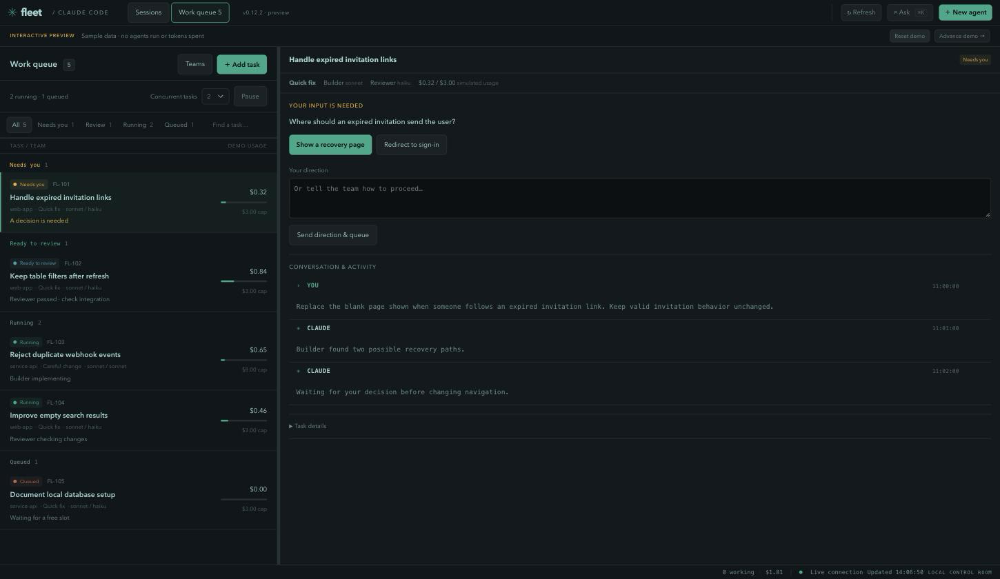

# Fleet task control — interactive prototype

```
npm run prototype        # then open http://127.0.0.1:7791
```

Fleet's own frontend, served with synthetic sessions, plus a **Work queue** tab beside
**Sessions**. Seeing the idea inside the real chrome is the point: it shows what the
screen would become, not what a separate mock looks like.



Nothing here runs a model, executes tests, opens a pull request, touches a repository
or merges anything. The server answers `GET` only and refuses every other method. All
tasks, costs, diffs, checks and events are illustrative. State lives in the browser
under `fleet-task-control-demo-v1`; **Reset demo** restores the five sample tasks.

`FLEET_PREVIEW_PORT` picks a different port.

## The idea

A task is the primary object. The board groups work by what you can do next rather
than by pipeline stage, so the queue reads as a list of decisions:

| Group | Means |
|---|---|
| Needs you | A question, or a task that hit its budget cap |
| Ready to review | Agent checks passed; the change wants a verdict |
| Running | A builder or reviewer is working |
| Queued | Waiting for a free slot |

The detail pane carries the assignment, the team it was given, the evidence produced,
and the one action that moves it forward.

## Try the loop

1. Open **Handle expired invitation links** and answer its question. It queues behind
   the two running tasks.
2. **Advance demo** moves every active task on one stage. Freed slots refill from the
   queue, up to the concurrency limit.
3. Open a task in **Ready to review**, read its diff and checks, then
   **Check integration** and advance until the result lands.
4. **Accept change**. The demo's base revision moves, which makes any integration
   result checked against the previous revision stale. Watch the other reviewed task
   say so.
5. Add a task, pause dispatch, lower the concurrency limit, or edit a team.

Pausing stops admission; work already running finishes. Lowering the limit does not
interrupt anything. Teams are snapshotted onto a task when it is assigned, so editing
a team changes future assignments and leaves current ones alone.

## Checks

```
npm test                 # includes this prototype's state tests
```

`state.js` is the whole simulation and has no DOM in it, which is what makes those
transitions testable. It loads as a browser script and as a CommonJS module.

## What this is not

A production version needs a durable dispatcher, isolated workspaces per task, real
evidence collection, cancel and recovery semantics, and a real relationship with
Fleet's approvals. None of that is here.
