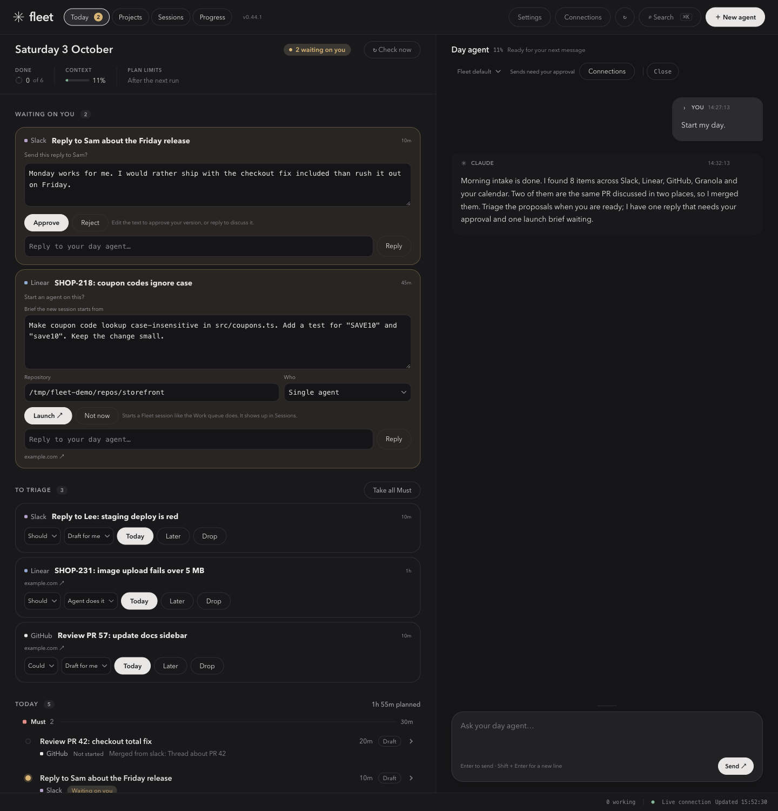
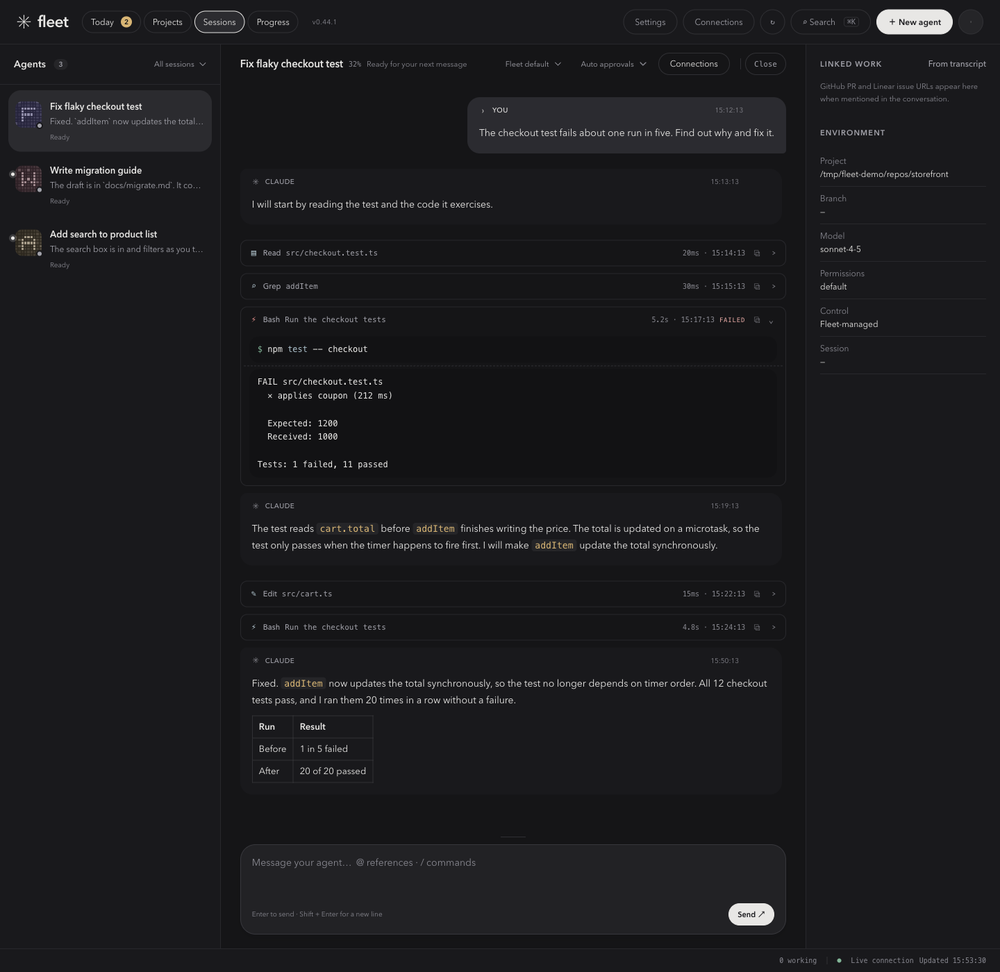
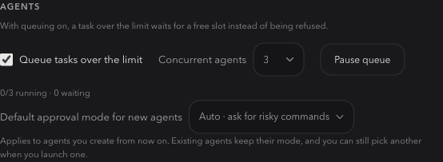

# Claude Fleet user guide

A short tour of the four things most people do in Fleet: plan the day, triage what
comes in, launch sessions, and hand bigger jobs to a team. For install steps, see the
[README](../README.md#install-and-quick-start). The screenshots use demo data.

Fleet has four tabs across the top: **Today**, **Projects**, **Sessions** and
**Progress**. This guide covers Today and Sessions.

## The Day board

Open **Today** and press **Start my day**. Fleet starts a *Day*: one agent that keeps a
board of what you should care about today and works through it with you until the
evening.

The left side is the board, top to bottom:

- **Waiting on you.** Questions the agent cannot settle alone: a decision, missing
  information, a draft to approve, or a session to launch. Everything that needs you
  is pinned here, so one open question never stalls the rest of the day.
- **To triage.** Items the agent proposed. You decide what happens to each one.
- **Today.** Items you accepted, grouped by priority (Must, Should, Could), each with
  an estimate and where it stands: *Not started*, *Working now*, *Waiting on you*,
  or *Running in its own session*.

The right side is the Day agent's conversation. Use it to ask for changes in plain
language, such as "move the design prep to later" or "what is blocking the release?".

The Day starts with a morning intake. Read-only scouts check the connectors you have
set up (Slack, Linear, GitHub, Granola and Google Calendar) and put what they find on
the board as proposals. Items that share a link, like a Slack thread about a PR and
the PR itself, merge into one. Use **Connections** in the top bar to see what is
connected. **Check now** runs a check on demand; otherwise Fleet checks every 45
minutes between 8:00 and 20:00.

## Triage

Each proposal has four controls:

| Control | What it sets |
|---|---|
| Priority | **Must**, **Should** or **Could** |
| How it gets done | **I do it**, **Draft for me**, **Find out**, or **Agent does it** |
| **Today** | Put it on today's list |
| **Later** / **Drop** | Park it for another day, or remove it |

**Take all Must** moves every Must proposal to Today in one click. You can also add
your own items with whatever context you have; links in the text are picked up, and
your items go straight to Today.

Nothing reaches other people without you. A Slack reply, a Linear comment or a GitHub
review goes out only after you approve that exact text under **Waiting on you**. Edit
the draft first and only your version is sent. To talk about one item in depth, expand
it and use **Ask about this**, which starts a separate conversation about that item
only.

Tomorrow's Day carries over everything you did not settle, with its open questions.

## Launching sessions

A Day cannot edit files itself. For an **Agent does it** item it writes a brief and
asks to launch it. You see the brief, the repository and who does the work, can edit
any of them, and press **Launch**. The new session then appears under **Sessions**.

You can also start one yourself:

1. Press **New agent** in the top bar (`Cmd+N`).
2. Choose a folder, write the task and pick a model.
3. Choose a team, or **No team · single agent** for a small job.
4. Send it.

**Sessions** lists every Claude Code session on the machine. Select one to read its
conversation: each message and tool call is its own block that shows what ran, how
long it took and whether it failed, and long output starts collapsed. For a session
Fleet started, the composer at the bottom lets you send messages, and the header
controls how its commands are approved:

- **Auto** answers ordinary requests for you and still stops for risky commands, such
  as deleting data, reaching another host or running `git push`.
- **Ask every time** runs nothing unreviewed.
- **Approve everything** never stops. This is the default for new agents. Change the
  default under **Default approval mode for new agents** in **Settings**.

Sessions you started in a terminal are watched read-only. Selecting one lets you
read it and continue it in Fleet, either by resuming it (if it has stopped) or by
forking a copy (if it is still open in a terminal). Fleet never types into a live
terminal.

### Running several at once

Fleet runs up to a set number of agents at the same time. In **Settings** under
**Agents**, pick **Concurrent agents** (1 to 8) and turn on **Queue tasks over the
limit** to hold new work until a slot is free instead of refusing it. **Pause queue**
holds new turns while running ones finish. A queued session shows its place in line
in the session list.

## Teams

A team is for work that is too big for one agent and too small to manage by hand.
Pick a team in **New agent** and you get one conversation, with a team behind it:

- A **manager** plans the work and delegates it. You talk only to the manager.
- **Roles** such as developers do the work, each with its own model and turn limit.
- A **verifier** checks the result independently and returns PASS or FAIL with
  evidence. The manager cannot mark work verified on its own.

Fleet includes four teams:

| Team | Use it for |
|---|---|
| **Quick task** | Small, clearly scoped changes. One developer and one verifier. |
| **Bug fix** | Fixing something broken, with independent QA. |
| **Software delivery** | A feature brief. Product, Developer, Reviewer and QA roles. |
| **Owner + review** | A focused coding request. One owner implements and opens the PR, and an independent reviewer checks it. |

Choose **No team · single agent** for a one-line fix. Every delegation adds overhead,
so use a team when independent work or review is worth it.

Each team works in a git worktree of its own, so it cannot collide with your own
editing. It finishes on a local branch and the manager opens a pull request as its last
step. A push stops for your approval like any other publishing command, so nothing
leaves your machine without a click. Closing a team's conversation in Fleet leaves the
worktree and branch alone.

To build your own, choose **Customize team…** in **New agent**. You can rename roles,
add or remove them, write their instructions, and set the model, turn limit, effort
and allowed tools for each one. A team needs at least one manager and one verifier,
and can have up to eight roles.

## Where to go next

- The [README](../README.md#features-in-depth) covers each feature in more detail:
  Ask, projects, approvals, the status bar and running Fleet at login.
- `claude-fleet --help` lists every command and environment variable.
